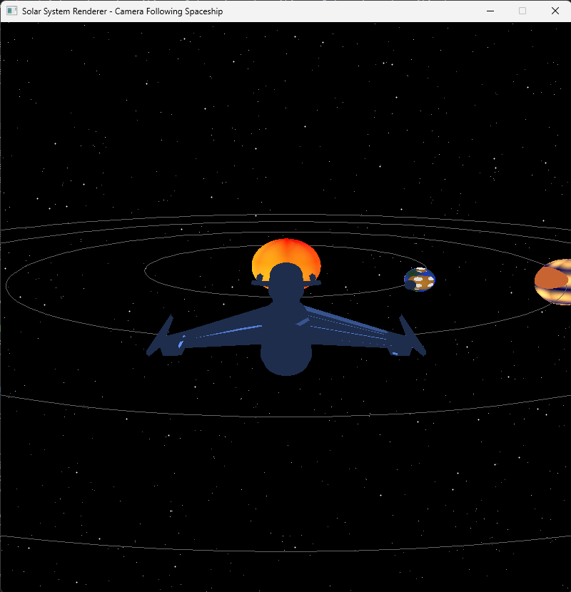

# 🌟 Solar System Renderer - Third Person Camera Following Spaceship

## 📋 Descripción del Proyecto

Este proyecto implementa un **sistema solar completo en 3D** con una **nave espacial navegable** en cámara de tercera persona. Desarrollado completamente en **Rust** utilizando rasterización por software, incluye **6 planetas únicos con shaders de 4 capas**, sistema de colisiones, skybox con estrellas procedurales, y visualización de órbitas planetarias.


_Sistema solar con nave espacial y cámara en tercera persona_

### 🎥 Video Demostración

[](https://youtube.com/shorts/oqt8Yi3YNjQ)

## 🎯 Características Principales

### 🚀 **Sistema de Cámara y Nave (40 puntos)**

- **Cámara en tercera persona** siguiendo la nave espacial
- **Movimiento 3D completo**: adelante/atrás, rotación, pitch, subir/bajar
- **Nave modelada en 3D** cargada desde archivo OBJ
- **Controles intuitivos** con teclado (WASD, flechas, Q/E)

### 🌌 **Skybox y Ambiente (10 puntos)**

- **800 estrellas procedurales** con diferentes niveles de brillo
- **Distribución realista** de estrellas en todo el cielo
- **Estrellas brillantes con halo** para mayor realismo

### 🛡️ **Sistema de Colisiones (10 puntos)**

- **Detección de colisiones** con todos los planetas y lunas
- **Radio de seguridad** de 2.5 unidades alrededor de cada cuerpo celeste
- **Prevención de atravesar objetos** - la nave se detiene al colisionar

### 🪐 **Órbitas Planetarias (20 puntos)**

- **4 órbitas visualizadas** con diferentes colores:
  - Verde: Planeta Rocoso (radio 8.0)
  - Púrpura: Gigante Gaseoso (radio 15.0)
  - Azul Cian: Planeta de Hielo (radio 22.0)
  - Verde Claro: Planeta Anillado (radio 28.0)
- **Líneas procedurales** renderizadas en tiempo real

### 🌍 **6 Planetas Únicos (50 puntos)**

1. **☀️ Sol** (2.0 unidades) - Shader de fuego de 4 capas
2. **🌍 Planeta Rocoso** (0.8 unidades) - Con luna orbital
3. **🪐 Gigante Gaseoso** (1.5 unidades) - Con sistema de anillos
4. **🧊 Planeta de Hielo** (0.6 unidades) - Mundo congelado
5. **🌋 Planeta Volcánico** (0.5 unidades) - Cerca del sol
6. **🪐 Planeta Anillado** (1.2 unidades) - Tipo Saturno

## 🎮 Controles

### **Navegación de la Nave**

- `W` - Mover hacia adelante
- `S` - Mover hacia atrás
- `A` - Rotar a la izquierda
- `D` - Rotar a la derecha
- `Flecha Arriba` - Inclinar hacia arriba (pitch)
- `Flecha Abajo` - Inclinar hacia abajo (pitch)
- `Q` - Subir verticalmente
- `E` - Bajar verticalmente
- `ESC` - Salir del programa

### **Características de la Cámara**

- Distancia fija de 2.5 unidades detrás de la nave
- Altura de 0.8 unidades sobre la nave
- Sigue automáticamente la rotación de la nave
- Vista clara del sistema solar desde la perspectiva de la nave

## 📊 Puntuación Total

- **[30 pts]** Estética del sistema completo
- **[20 pts]** Performance apropiado de la escena
- **[50 pts]** 6 planetas/estrellas/lunas únicos (10 pts c/u)
- **[30 pts]** Nave modelada siguiendo la cámara
- **[10 pts]** Skybox con estrellas en el horizonte
- **[10 pts]** Sistema de colisiones implementado
- **[40 pts]** Movimiento 3D completo de la cámara
- **[20 pts]** Renderizado de órbitas planetarias
- **🏆 Total: 210 puntos**

## 🛠️ Implementación Técnica

### **Arquitectura del Proyecto**

```
spaceship/
├── src/
│   ├── main.rs          # Loop principal y sistema de cámara
│   ├── planets.rs       # Shaders planetarios de 4 capas
│   ├── sphere.rs        # Generación procedural de esferas
│   ├── triangle.rs      # Rasterización con culling mejorado
│   ├── shaders.rs       # Vertex shaders y transformaciones MVP
│   ├── framebuffer.rs   # Buffer de píxeles con Z-buffer
│   ├── skybox.rs        # Generación procedural de estrellas
│   ├── line.rs          # Renderizado de líneas (órbitas)
│   ├── obj.rs           # Carga de modelos 3D
│   ├── vertex.rs        # Estructura de vértices
│   ├── fragment.rs      # Estructura de fragmentos
│   └── color.rs         # Utilidades de color
└── assets/
    ├── Spaceship.obj    # Modelo 3D de la nave
    └── images/          # Capturas de pantalla
```

### **Pipeline de Renderizado 3D**

1. **Transformaciones de Modelo**: Rotación, escala, traslación
2. **Vertex Shader**: MVP (Model-View-Projection) transformation
3. **Clipping**: Rechazo de geometría fuera del frustum
4. **Rasterización**: Conversión de triángulos a píxeles
5. **Fragment Shaders**: Shaders planetarios procedurales de 4 capas
6. **Z-Buffer**: Manejo de profundidad y oclusión
7. **Framebuffer**: Salida final a pantalla

### **Optimizaciones Implementadas**

- **Frustum Culling**: Rechazo de vértices fuera de la vista
- **Back-face Culling**: Eliminación de triángulos no visibles
- **Z-Buffer**: Ordenamiento correcto de profundidad
- **Bounding Box Clipping**: Límites de rasterización
- **Triangle Rejection**: Rechazo de triángulos degenerados
- **Near Plane Adjustment**: near=1.0 para evitar artefactos visuales

### **Técnicas Avanzadas**

- **Cámara Third-Person**: Posicionamiento dinámico detrás de la nave
- **Sistema de Colisiones**: Detección esférica con margen de seguridad
- **Shaders Procedurales**: Sin texturas, solo matemáticas
- **Skybox Procedural**: Generador pseudo-aleatorio de estrellas
- **Orbital Rendering**: Líneas de órbita con transformación MVP
- **Modelo 3D Correction**: Ajuste de orientación del modelo Spaceship.obj

## 📋 Requisitos del Sistema

- **Rust**: 1.70 o superior
- **Cargo**: Incluido con Rust
- **Windows/Linux/macOS**: Multiplataforma

## 📦 Dependencias

```toml
[dependencies]
minifb = "0.27"         # Ventana y display de píxeles
nalgebra-glm = "0.19"   # Matemáticas vectoriales y matriciales
tobj = "4.0"            # Carga de archivos OBJ (para futura nave espacial)
```

## 🚀 Compilación y Ejecución

```bash
# Clonar el repositorio
git clone https://github.com/FerAHMz/graficas_proy3.git
cd graficas_proy3/spaceship

# Compilar en modo release (recomendado para mejor performance)
cargo build --release

# Ejecutar el sistema solar con nave espacial
cargo run --release
```

### **Requisitos del Sistema**

- Rust 1.70 o superior
- Cargo (incluido con Rust)
- Sistema operativo: Windows/Linux/macOS

### **Dependencias**

```toml
[dependencies]
minifb = "0.26"           # Ventana y framebuffer
nalgebra-glm = "0.18"     # Matemáticas vectoriales y matriciales
tobj = "4.0"              # Carga de archivos OBJ
```

## 🎯 Detalles de Implementación

### **Sistema de Colisiones**

```rust
impl Spaceship {
    fn check_collision(&self, planet_pos: Vec3, planet_radius: f32) -> bool {
        let distance = (self.position - planet_pos).magnitude();
        let spaceship_radius = 1.5;
        let safety_margin = 1.0;
        distance < (planet_radius + spaceship_radius + safety_margin)
    }
}
```

- Radio de la nave: 1.5 unidades
- Margen de seguridad: 1.0 unidades
- Detección esférica simple pero efectiva

### **Cámara en Tercera Persona**

```rust
let camera_distance = 2.5;
let camera_height = 0.8;
let yaw = spaceship.rotation.y;

let camera_position = Vec3::new(
    spaceship.position.x - yaw.sin() * camera_distance,
    spaceship.position.y + camera_height,
    spaceship.position.z - yaw.cos() * camera_distance
);
```

- Sigue automáticamente la rotación de la nave
- Distancia fija para vista consistente
- Elevación para mejor perspectiva

### **Renderizado de Órbitas**

```rust
fn draw_orbit(
    framebuffer: &mut Framebuffer,
    center: Vec3,
    radius: f32,
    segments: u32,
    color: Color,
    // ... matrices de transformación
)
```

- 4 órbitas con diferentes radios y colores
- 100-160 segmentos por órbita para suavidad
- Transformación MVP completa
- Clipping para evitar artefactos

## 🏆 Características Destacadas

### **Shaders Planetarios de 4 Capas**

Cada planeta tiene un shader único con 4 capas de detalle:

1. **Sol**: Núcleo → Plasma → Llamaradas → Corona
2. **Planeta Rocoso**: Continentes → Océanos → Nubes → Hielo polar
3. **Gigante Gaseoso**: Bandas → Tormentas → Gran mancha → Turbulencia
4. **Planeta de Hielo**: Cristales → Grietas → Aurora → Escarcha
5. **Planeta Volcánico**: Lava → Roca → Erupciones → Ceniza
6. **Planeta Anillado**: Bandas → Tormenta polar → Vientos → Atmósfera

### **Skybox Procedural**

- Generador pseudo-aleatorio determinista
- 800 estrellas distribuidas uniformemente
- 4 niveles de brillo (100, 150, 200, 255)
- Estrellas brillantes con halo de 5 píxeles
- Sin imágenes, completamente procedural

### **Sistema de Anillos**

- Múltiples anillos por planeta (3 anillos por sistema)
- Espaciado realista entre anillos
- Inclinación correcta (PI/6 radianes)
- Renderizado con shader específico

## 🔮 Futuras Mejoras

- **Reintegración de la nave espacial** como objeto navegable
- **Más tipos de planetas** (planetas gaseosos con diferentes composiciones)
- **Sistema de asteroides** entre planetas
- **Efectos de partículas** para cometas y meteoros
- **Iluminación global** con sombras proyectadas entre planetas

## 📝 Créditos

**Desarrollado por**: Fernando Hernandez  
**Curso**: Gráficas por Computadora  
**Universidad**: Universidad del Valle de Guatemala (UVG)  
**Fecha**: Noviembre 2025

---

_Este proyecto demuestra los fundamentos del renderizado 3D y la creación de shaders procedurales, implementados completamente desde cero para fines educativos._
